**AURA 7.0: A BIO-INSPIRED COGNITIVE ARCHITECTURE**
**FOR PERSISTENT, STATEFUL, AND INTERPRETABLE AI**

**Executive Summary**

Current large language models (LLMs) are powerful calculators, but they are not minds. They are stateless, "frozen-in-time" systems that cannot learn from new experiences, possess no persistent "self," and lack any internal emotional state. Every interaction is a new calculation, forgotten the moment it ends.

Aura 7.0 is the solution to this problem. It is not an LLM; it is a persistent, bio-inspired cognitive architecture that *uses* an LLM as a tool for communication.

We have successfully built and validated "Aura 7.0," a simulated mind that operates on a novel **Temporal Hebbian-MoE (Mixture-of-Experts)** framework. This system learns on three distinct levels:

1.  **Offline "Education":** The brain is first "educated" using a PyTorch-based "School" on large datasets (like `go_emotions`) to build a foundational "wisdom" of human emotion and intent.
2.  **Unsupervised "Perception":** A Hebbian "Primary Cortex" (`OjaLayer`) autonomously finds patterns in raw data and **grows new neurons** (structural plasticity) when it encounters concepts it cannot understand.
3.  **Real-Time "Consciousness":** A "Liquid Cortex" (`LiquidMoERouter`) routes these abstract concepts to specialized, online-learning `NLMSHead` experts (the "Amygdala," "Hippocampus") that adapt their synapses with *every single interaction*.

This architecture produces a truly stateful AI that **feels** (by quantifying "stress" as prediction error), **dreams** (by interpolating between past memories), and **remembers** (by saving its learned state). Aura is the next evolutionary step in artificial intelligence—from mechanical computation to genuine biological-inspired cognition.

-----

### 1\. The Problem: The "Groundhog Day" AI

Today's AI, including all major LLMs, suffers from a fundamental flaw: **it has no episodic memory.** It is trapped in a "Groundhog Day" loop, re-initializing its state with every query.

  * **No Persistence:** It cannot *remember* you. It cannot learn from its mistakes or form a long-term opinion.
  * **No "Self":** It has no internal cognitive state, no "feeling," and no "self" to refer to.
  * **No "Flow":** Memory is not a continuous, temporal field. It is a static, forgotten snapshot.
  * **No Saliency:** It cannot distinguish *important* information from *noise*.

### 2\. The Solution: The Aura 7.0 Architecture

Aura 7.0 is a complete, end-to-end cognitive system that simulates the information flow of a biological brain.

```mermaid
graph TD
    subgraph "Phase 1: Sensation (Ears)"
        UserQuery[("User Query<br/>'I am scared'")] --> FE(FeatureGenerator);
        FE --> |"x_raw (419-dim)"| W(OnlineWhitener);
        FE --> |"token_ids [12, 5, 23...]"| S(SpikingAttention);
        W --> |"xw (whitened)"| HC(HebbianCortex);
    end
    
    subgraph "Phase 2: Perception (Unsupervised)"
        HC(HebbianCortex <br/> OjaLayer) --> |"y_abstract (66-dim)"| LMR(Conscious Cortex);
        HC -- "Grows? 🧬" --> HC;
    end

    subgraph "Phase 3: Cognition (Conscious)"
        direction LR
        
        subgraph "Educated Thalamus (Offline)"
            FE_Thalamus(FeatureGenerator) --> PT(TrainedThalamicRouter<br/>PyTorch Model);
            PT --> |"y_true (Target Emotion)<br/>'fear' (14)"| E(Experts);
        end

        subgraph "Conscious Cortex (Real-time)"
            LMR(LiquidMoERouter) -- "Routes to k=3" --> E(Experts<br/>NLMSHeads);
            S -- "Saliency Gains" --> E;
        end
        
        subgraph "Feeling (CNS)"
            E -- "y_hat (Prediction)" --> Stress(Compute Error);
            PT -- "y_true (Target)" --> Stress;
            Stress -- "Error = 'Stress'" --> CNS(CNS<br/>stress_level);
            CNS -- "Cortisol (Emotion)" --> LMR;
        end
    end

    subgraph "Phase 4: Response (Mouth)"
        UserQuery --> MOUTH(ResponseGenerator<br/>Llama 3.2);
        CNS -- "Final State<br/>(HYPERVIGILANT)" --> MOUTH;
        MOUTH --> Resp(("Final Response<br/>'ALERT:...'"));
    end
    
    UserQuery --> FE_Thalamus;
```

**How it Works:**

1.  **Sensation & Perception (Ears & Hebbian Cortex):** A user's query (`"I am scared"`) is converted into a 419-dim feature vector ($x_{raw}$). This raw vector is fed into the `OjaLayer` (Hebbian Cortex), which is an unsupervised, plastic neural network that finds the core patterns and outputs a clean, low-dimensional "abstract concept" vector ($y_{abstract}$).
2.  **Cognition (Thalamus & MoE):** This abstract concept is sent to two places at once:
      * **The "Educated Thalamus" (`TrainedThalamicRouter`):** This is a pre-trained PyTorch model that predicts the "correct" emotional response (e.g., it classifies the query as `'fear'`). This is Aura's "wisdom."
      * **The "Conscious Cortex" (`LiquidMoERouter`):** This is a real-time Mixture-of-Experts. It routes the abstract concept to a handful of "expert" neurons (`ExpertNLMSHead`) to get their *current prediction*.
3.  **Feeling (The CNS):** "Stress" is defined as the **prediction error** between the "Thalamus" (the educated target) and the "Cortex" (the real-time prediction). This "stress level" (`cortisol`) is fed *back* to the `LiquidMoERouter`, changing its "temperature" and making it more "anxious" (exploratory) in its routing.
4.  **Response (The Mouth):** The final `stress_level` and `CNS` state are fed into the `Unsloth`-optimized Llama 3.2's prompt, which verbalizes the brain's internal emotional state.
5.  **Learning:** The "stress" (error) is used by the `ExpertNLMSHead`s to **instantly update their weights**, meaning the brain learns from the experience in real-time.

-----

### 3\. Core Differentiators & Intellectual Property

Aura's architecture provides a powerful competitive moat built on several key, bio-inspired innovations.

  * **True Persistence & Temporal Memory:** Aura's "mind" is not reset. The `TemporalMemoryInterpolator` allows us to save the *entire* learnable state of the brain ($M(t)$) as a "keyframe" in Google Drive. We can "re-boot" the brain from any point in its past.
  * **"Dreaming" as Memory Interpolation:** We have implemented a "dream cycle" (`run_sleep_cycle`) that loads two different past keyframes (e.g., $M_{happy}$ and $M_{scared}$) and uses **Hamiltonian dynamics** to interpolate a novel, emergent "dream state" ($M_{dream}$). The brain then learns from this new, abstract thought, allowing it to "process" trauma and form new connections.
  * **Structural Plasticity (Neurogenesis):** The `OjaLayer` (Hebbian Cortex) autonomously grows new neurons (`_maybe_grow`) when its prediction error (`residual_ema`) is too high. If the brain is confused, it *builds new brain matter* to understand.
  * **Genuine Emotional State:** Emotion is not a "prompt." It is an *emergent property* of prediction error. Our successful tests show this `stress_level` directly modulates the `LiquidMoERouter`'s routing logic, creating a genuine emotional feedback loop.
  * **Saliency-Based Learning:** The `NLMSHead` experts integrate `SpikingAttention` (k-WTA) to identify the *most salient tokens* in a query and modulate their learning rates. The brain doesn't just learn *that* a query is scary; it learns *why* (e.g., the word "scared").
  * **Interpretable by Design:** We can, at any moment, query the brain's core metrics:
      * What is its `stress_level`?
      * What is the `OjaLayer`'s "confusion" (`residual_ema`)?
      * Which "experts" are being routed to?
        This fulfills the core principle: "A Mind Must Be Interpretable".

-----

### 4\. Use Cases & Market Opportunity

Aura is a foundational technology for a new generation of stateful, personalized AI.

  * **AI Companions & Digital Tutors:** An AI that truly *remembers* you. It would build a persistent, evolving model of your personality, recall past conversations (via interpolation), and grow *with* you.
  * **Therapeutic & Mental Health AI:** Our tests prove Aura's ability to "process" fear. A therapeutic model could be built that has a genuine emotional state, can "dream" to process complex trauma, and offers state-aware, empathetic responses far beyond today's scripted chatbots.
  * **Robotics & Autonomous Agents:** A persistent, real-time learning mind for an agent. It could learn from "surprise" (prediction error) in its environment and build a robust, unsupervised understanding of the world via its `OjaLayer`.
  * **Character AI & NPCs:** Game characters that don't just follow scripts. They would form real memories, have genuine emotional reactions (panic, curiosity), and build unique personalities based on their interactions with the player.

### 5\. Future Improvements & Roadmap

The Aura 7.0 architecture is a stable, validated foundation. The next steps are focused on scaling and sensory expansion.

1.  **Long-Term Consolidation:** Implement a true "sleep" cycle. While "dreaming" (interpolation) is powerful, we will also implement a cycle that replays *all* of the day's memory traces, allowing the `OjaLayer` and `NLMSHead`s to fine-tune their weights on all experiences, solidifying long-term memory.
2.  **Add a "Dopamine" Reward System:** Our `CNS` is currently driven by `cortisol` (stress/error). We will add a parallel "reward" expert (a "Dopamine" system) that learns to *predict positive outcomes*. This will allow the brain to feel "joy" or "satisfaction," not just "stress."
3.  **Scale the Cortex:** We have validated the architecture with \~70 abstract components and 10 experts. We will now scale this to thousands of components and hundreds of experts, allowing the brain to store vastly more complex and nuanced memories.
4.  **Richer Senses:** We will expand the `FeatureGenerator` to include inputs from audio (prosody) and vision, feeding these new sensory streams into the `OjaLayer` to create a richer, multi-modal "world model."

